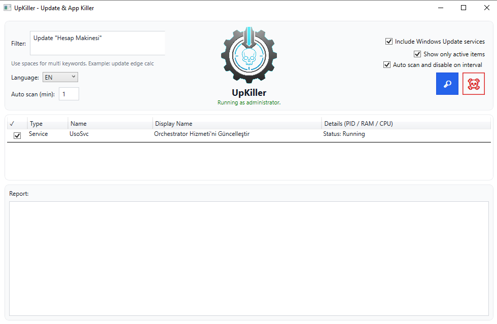

# UpKiller

<p align="center">
  
</p>

UpKiller is a small but opinionated Windows utility for people who are tired of “helpful” software that never really closes.

Every installer seems to drop its own **update agents, background services and scheduled tasks** into your system.  
You close the main app, but in Task Manager and Services you still see:

- update processes waking up on their own,
- services that quietly restart after you kill them,
- scheduled tasks that keep bringing everything back.

UpKiller’s job is simple:

> **Find anything update‑like that is still running, let you review it, and then kill / disable it with a single click.**

---

## Download & Run (non‑dev users)

If you are **not a developer** and just want to use UpKiller:

1. Go to the **latest release** page  
   `https://github.com/Warreis2024/UpKiller/releases/latest`
2. Under **Assets**, download **only** the file named something like:
   - `UpKiller.exe`  
   _Do **not** download the “Source code (.zip/.tar.gz)” files if you just want to run the app._
3. After download, right‑click `UpKiller.exe` → **Run as administrator** (recommended).
4. Windows Defender / SmartScreen may say *“Windows protected your PC”* because the exe is not code‑signed:
   - Click **More info** → **Run anyway** if you trust the project, or
   - Build the exe yourself from source (see the “Building & Single‑File Publish” section below).
5. In the app:
   - Type your filter (for example: `update "Calculator"`),
   - Review the list and uncheck anything you don’t want touched,
   - Click the blue 🔎 icon to scan again,
   - Click the red 💀 icon to disable the selected items.

UpKiller does **not** silently change anything: you always see what will be affected and must confirm before it acts.

---

## Screenshot

<p align="center">
  
</p>

---

## What UpKiller Does

- **Processes**
  - Lists running processes that match your filters (including quoted multi‑word filters like `Update "Calculator"`).
  - Shows PID, RAM usage and total CPU time.
  - Kills selected processes when you press the skull button.

- **Services**
  - Lists services whose names or display names match your filters.
  - Can optionally include well‑known Windows Update–related services.
  - For selected services:
    - stops them (if running),
    - changes startup type to `disabled` via `sc.exe`.

- **Scheduled Tasks**
  - Queries `schtasks.exe` and shows tasks whose names/status match your filters.
  - Disables selected tasks.

- **Filtering**
  - Plain text search: `update edge widget`
  - Quoted phrases: `Update "Calcuate"`
  - “Show only active items” to hide already stopped / disabled entries.

- **Automation**
  - Optional **auto scan and disable** timer (minutes).
  - System tray support; can keep running in the background.

- **Localization**
  - JSON‑based language files in `lang/*.json` (default: English).  
  - Easy to extend with new languages via pull requests.

---

## How It Works (High Level)

1. **Scan**
   - Reads processes via `System.Diagnostics.Process`.
   - Reads services via `System.ServiceProcess.ServiceController`.
   - Reads scheduled tasks via `schtasks /Query /FO CSV /V`.

2. **Filter**
   - Builds a token list from the filter box (supports quoted phrases).
   - Matches tokens against process names / window titles, service names / display names, and task names / status.

3. **Review**
   - Everything is listed in a single grid: type, name, display name, details.
   - All rows start selected; you uncheck anything you don’t want touched.

4. **Act**
   - Processes → `Kill(true)` + wait.
   - Services → `Stop()` + `sc config "<service>" start= disabled`.
   - Tasks → `schtasks /Change /TN "<task>" /Disable`.
   - A detailed, timestamped report is written to the bottom pane.

UpKiller never silently acts; the user always confirms before changes are applied.

---

## Safety Notes

- For full functionality you should run UpKiller as **Administrator**.
- Disabling random services and tasks can break software or system features.
- Recommendation:
  - Start with obviously safe targets (3rd‑party updaters you recognize).
  - Avoid disabling core Windows components unless you know exactly what they do.

---

## Building & Single‑File Publish

Restore and run in dev:

```bash
dotnet restore
dotnet run -c Release
```

Create a **single‑file** self‑contained exe for Windows x64:

```bash
dotnet publish -c Release -r win-x64 --self-contained true ^
  /p:PublishSingleFile=true ^
  /p:IncludeNativeLibrariesForSelfExtract=true
```

The resulting `UpKiller.exe` will be under:

```text
bin/Release/net8.0-windows/win-x64/publish/
```

---

## Contributing

Contributions are very welcome:

- new language files in `lang/*.json`,
- better matching rules for update‑related services/tasks,
- UI/UX polish,
- docs and examples,
- bug fixes and performance tweaks.

Open an issue or PR on GitHub and we’ll take it from there.

---

## License

This project is released under the **MIT License**.  
See [`LICENSE`](LICENSE) for full details.

# UpKiller

<p align="center">
  
</p>

Windows'ta sessizce arka planda kalan `update` odakli process, service ve scheduled task kalintilarini temizlemek icin yazilmis kucuk ama etkili bir arac.

Bircok yazilim kurulumdan sonra kendi guncelleme mekanizmasini sisteme ekler. Uygulamayi kapatsan bile:
- servis calismaya devam eder,
- gorev zamanlayicida tetikleyici kalir,
- process yeniden dogar.

UpKiller tam bu noktada devreye girer: listele, kontrol et, sec ve devre disi birak.

 
## Neden UpKiller?

- Gereksiz arka plan calismalarini azaltir.
- Kaynak tuketimini (CPU/RAM) gorunur hale getirir.
- Tek tusla birden fazla hedefte temizlik yapar.
- Kullanicinin kontrolunde calisir (once listele, sonra uygula).

---

## Ozellikler

- `Process` / `Service` / `Scheduled Task` tarama
- Cift tirnakli arama (`Update "Hesap Makinesi"` gibi)
- Sadece aktif olanlari gosterme
- Windows Update servisleri icin ozel filtre
- Sistem tepsisinde calisma
- Dakika bazli otomatik tarama/devre disi birakma
- Tur + detay gorunumu (PID / RAM / CPU Time)
- Coklu dil destegi (JSON tabanli, varsayilan: EN)
- Ayarlari kapatip acinca hatirlar (`%AppData%/UpKiller/settings.json`)

---

## Calisma Mantigi

1. Filtreye gore hedefleri listeler.
2. Kullanici secimi (checkbox) ile son karari verir.
3. Uygulama turune gore islem yapar:
   - Process -> kill
   - Service -> stop + startup disabled
   - Scheduled Task -> disable
4. Sonucu rapor alanina yazar.

---

## Guvenlik Notu

Bu arac sistem servislerine dokunur. Tam islev icin **yonetici olarak calistirilmasi** gerekir.

Oneri:
- Bilmedigin servisleri devre disi birakma.
- Once listeyi incele, sonra uygula.

---

## Gelistirme

```bash
dotnet restore
dotnet run -c Release
```

Tek dosya exe uretimi:

```bash
dotnet publish -c Release -r win-x64 --self-contained true /p:PublishSingleFile=true /p:IncludeNativeLibrariesForSelfExtract=true
```

---

## Katki

Bu proje acik kaynak gelistirme icin hazirlandi.

Katki vermek istersen:
- Issue ac
- PR gonder
- Dil dosyalarini (`lang/*.json`) iyilestir
- Yeni servis/task algilama kurallari ekle
- UI/UX duzenlemeleri yap

Her katki degerli.

---

## Lisans

Bu proje **MIT License** ile dagitilmaktadir. Ayrintilar icin [LICENSE](LICENSE) dosyasina bakabilirsin.
